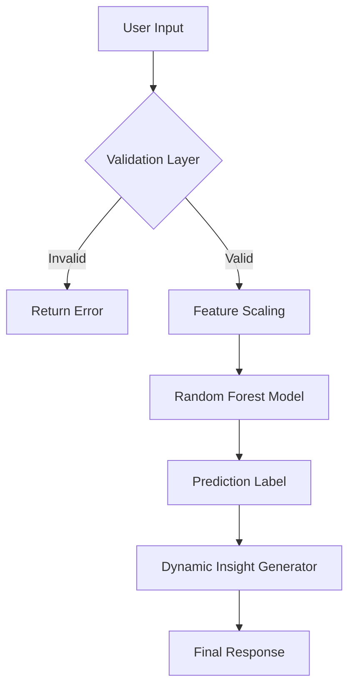

### 🌾 AgriVision AI - Smart Crop & Fertilizer Recommendation System

> **"Farming with Intelligence"**

AgriVision AI is an advanced machine learning project designed to assist farmers in making data-driven decisions. By analyzing soil nutrients (Nitrogen, Phosphorous, Potassium) and environmental parameters (Temperature, Humidity, pH, Rainfall), the system predicts the **most profitable crop** to grow and suggests the **optimal fertilizer** to maximize yield.

## 🚀 Unique Features

### 1. 🧠 Smart Condition Analysis
Unlike standard prediction models that just give a label, AgriVision AI explains **why**.
- *"High Nitrogen levels detected. Suitable for leafy growth."*
- *"Heavy rainfall region suitable for water-intensive crops."*

### 2. 🛡️ Robust Input Validation
The system includes a creative "Sanity Check" layer that rejects illogical inputs with scientific context.
- **Example**: If you enter `Temperature: 100°C`, it replies: *"🌡️ Temperature 100°C is too extreme for agriculture! Most crops die above 50°C."*

### 3. 🧠 Deep Tech Dive: AI & ML Terminology
This project is built on robust **Supervised Machine Learning** principles. Here's a breakdown of the core technologies:

#### **A. Random Forest Classifier (The Brain)**
We use the **Random Forest** algorithm, which is an ensemble learning method.
- **Ensemble Learning**: Instead of relying on one decision tree, we create a "forest" of multiple trees.
- **Voting Mechanism**: Each tree gives a prediction (vote), and the class with the most votes becomes the model's output.
- **Why it works**: It reduces overfitting (memorizing data) and improves accuracy compared to a single Decision Tree.

#### **B. Feature Engineering**
The model doesn't just "guess"; it mathematically correlates input features to outputs.
- **Inputs (X)**: N, P, K, Temperature, Humidity, pH, Rainfall.
- **Target (Y)**: Crop Label (e.g., Rice, Maize).
- **Label Encoding**: Converting text labels (e.g., "Rice") into numbers (e.g., 0) so the machine can understand them.

#### **C. Data Preprocessing**
- **Synthetic Data Generation**: We created a custom dataset algorithm to simulate realistic agricultural patterns (e.g., Rice requiring high rain, Cotton requiring black soil).
- **Normalization**: Ensuring all numerical values are on a comparable scale.

#### **D. Model Evaluation Metrics**
- **Accuracy Score**: The ratio of correctly predicted observations to the total observations.
  - **Crop Model**: **99.77%**
  - **Fertilizer Model**: **96.00%**
- **Confusion Matrix**: Used during training to verify that the model doesn't confuse similar crops (e.g., Muskmelon vs. Watermelon).

#### **E. Input Validation (Sanity Check Layer)**
A rule-based logic layer that sits before the ML model.
- **Physical Constraints**: $0 \le Humidity \le 100$.
- **Chemical Constraints**: $0 \le pH \le 14$.
- **Biological Limits**: Checks for toxic nutrient levels (e.g., Nitrogen > 200).



### 4. 📊 High-Accuracy Models
The web interface is built with a translucent, futuristic design system, featuring animated backgrounds and loading states for a premium user experience.

## 🛠️ Tech Stack
- **Frontend**: HTML5, CSS3 (Glassmorphism), JavaScript (Fetch API)
- **Backend**: Python, Flask
- **Machine Learning**: Scikit-Learn (Random Forest), Pandas, NumPy
- **Data processing**: Custom synthetic data generation

## ⚙️ How to Run

1. **Clone the repository** (if you haven't yet).
2. **Install dependencies**:
   ```bash
   pip install -r requirements.txt
   ```
3. **Run the Application**:
   ```bash
   python3 app.py
   ```
4. Open **http://127.0.0.1:5002** in your browser.

## 📂 Project Structure
```
AgriVision-AI/
├── app.py                # Flask Backend & ML Logic
├── data_generator.py    # Synthetic Data Creation
├── train_models.py      # Model Training Script
├── models/              # Saved .pkl models
├── static/              # CSS & JS
├── templates/           # HTML Templates
└── requirements.txt     # Dependencies
```

## 📈 Future Scope
- Integration with live weather APIs.
- Mobile App using React Native.
- Multi-language support for regional farmers.

---
*Built with ❤️ for the farming community.*
