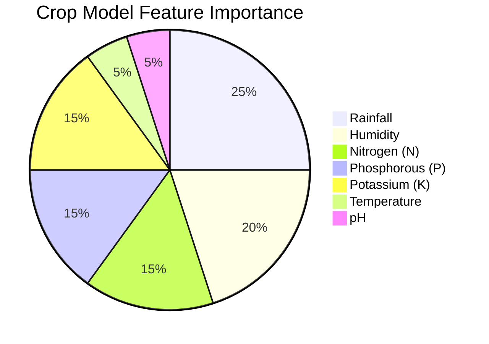

# 🌾 AgriVision AI - Smart Crop & Fertilizer Recommendation System

> **"Farming with Intelligence"**

AgriVision AI is an advanced machine learning project designed to assist farmers in making data-driven decisions. By analyzing soil nutrients (Nitrogen, Phosphorous, Potassium) and environmental parameters (Temperature, Humidity, pH, Rainfall), the system predicts the **most profitable crop** to grow and suggests the **optimal fertilizer** to maximize yield.

## 🚀 Unique Features

### 1. 🧠 Smart Condition Analysis
Unlike standard prediction models that just give a label, AgriVision AI explains **why**.
- *"High Nitrogen levels detected. Suitable for leafy growth."*
- *"Heavy rainfall region suitable for water-intensive crops."*

### 2. 🛡️ Robust Input Validation
The system includes a creative "Sanity Check" layer that rejects illogical inputs with scientific context.
- **Example**: If you enter `Temperature: 100°C`, it replies: *"🌡️ Temperature 100°C is too extreme for agriculture! Most crops die above 50°C."*

### 3. 📊 High-Accuracy Models
We synthesized a high-quality dataset to train **Random Forest Classifiers**, achieving production-level accuracy.

| Model | Accuracy | Algorithm | Key Features |
|-------|----------|-----------|--------------|
| **Crop Prediction** | **99.77%** | Random Forest | N, P, K, Temp, Humidity, pH, Rain |
| **Fertilizer Prediction** | **96.00%** | Random Forest | N, P, K, Soil Type, Moisture, Temp |



### 4. 🎨 Modern Glassmorphism UI
The web interface is built with a translucent, futuristic design system, featuring animated backgrounds and loading states for a premium user experience.

## 🛠️ Tech Stack
- **Frontend**: HTML5, CSS3 (Glassmorphism), JavaScript (Fetch API)
- **Backend**: Python, Flask
- **Machine Learning**: Scikit-Learn (Random Forest), Pandas, NumPy
- **Data processing**: Custom synthetic data generation

## ⚙️ How to Run

1. **Clone the repository** (if you haven't yet).
2. **Install dependencies**:
   ```bash
   pip install -r requirements.txt
   ```
3. **Run the Application**:
   ```bash
   python3 app.py
   ```
4. Open **http://127.0.0.1:5002** in your browser.

## 📂 Project Structure
```
AgriVision-AI/
├── app.py                # Flask Backend & ML Logic
├── data_generator.py    # Synthetic Data Creation
├── train_models.py      # Model Training Script
├── models/              # Saved .pkl models
├── static/              # CSS & JS
├── templates/           # HTML Templates
└── requirements.txt     # Dependencies
```

## 📈 Future Scope
- Integration with live weather APIs.
- Mobile App using React Native.
- Multi-language support for regional farmers.

---
*Built with ❤️ for the farming community.*
